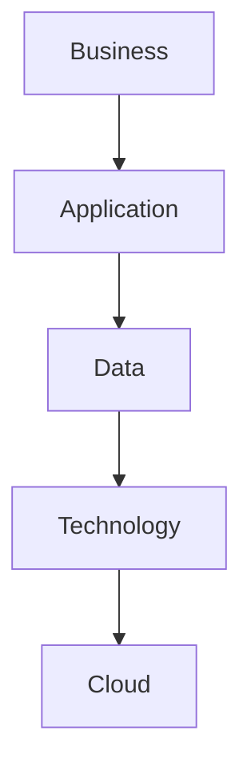

# Enterprise Architecture Fundamentals

## What is Enterprise Architecture?

Enterprise Architecture (EA) is the discipline of aligning business strategy, processes, information, applications and technology to achieve organizational objectives.

Enterprise Architecture provides a holistic view of the enterprise and supports decision-making for digital transformation.

---

## The Four Architecture Domains

### Business Architecture

Defines business capabilities, processes, organization and value streams.

### Application Architecture

Describes software systems, interactions and responsibilities.

### Data Architecture

Defines data ownership, governance, lifecycle and integration.

### Technology Architecture

Describes infrastructure, cloud platforms, networks and runtime environments.

---

## Enterprise Architecture Goals

- Business & IT Alignment
- Standardization
- Governance
- Technology Rationalization
- Agility
- Cost Optimization
- Innovation

---

## Architecture Principles

1. Business First
2. API First
3. Cloud Native
4. Security by Design
5. Automation First
6. Event Driven
7. Observability by Default
8. Reuse Before Build
9. Data is an Asset
10. Simplicity over Complexity

---

## Enterprise Architecture Layers

---

## Expected Deliverables

An Enterprise Architecture practice should provide:

- Principles
- Standards
- Reference Architectures
- Target Architectures
- Transition Architectures
- Technology Radar
- Architecture Reviews
- Architecture Repository

!!! tip

    Enterprise Architecture is not about producing documents.

    It is about enabling better decisions.
